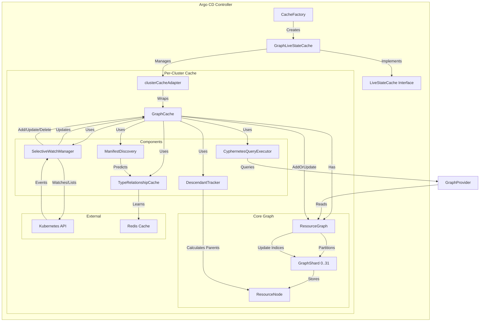

# Argo CD Graph Cache Architecture

This document describes the architecture of the in-memory graph cache designed to optimize resource tracking and relationship queries in Argo CD.

## Component Description

### 1. GraphLiveStateCache
The entry point that implements the `LiveStateCache` interface required by Argo CD's controller. It manages a map of `clusterCacheAdapter` instances, providing **strict per-cluster isolation**.

### 2. clusterCacheAdapter
Wraps a single `GraphCache` instance for a specific cluster. It translates `gitops-engine` cache calls (like `IterateHierarchy`, `GetManagedLiveObjs`) into graph traversals.

### 3. GraphCache
The central coordinator for a single cluster. It initializes and ties together the graph storage, watch manager, and query engines.

### 4. ResourceGraph (Sharded)
The core in-memory data structure.
*   **Sharding:** Divided into 32 shards (`GraphShard`) to minimize lock contention during high-volume updates.
*   **Storage:** Stores `ResourceNode`s indexed by `kube.ResourceKey` (GVK + NS + Name).
*   **Indices:** Maintains reverse indices for efficient lookups by Application and GroupKind.

### 5. ResourceNode
A lightweight representation of a Kubernetes resource.
*   **Memory Optimization:** Stores only metadata (`ResourceMetadata`) instead of the full `unstructured.Unstructured` object to prevent OOM.
*   **Relationships:** explicitly stores `Parents` and `Children` edges for O(1) traversal.

### 6. SelectiveWatchManager
Responsible for establishing watches against the Kubernetes API.
*   It dynamically adds watches only for resource types that are relevant to managed applications, reducing API server load.

### 7. DescendantTracker
Implements domain logic to infer parent-child relationships that aren't explicitly defined by `OwnerReferences` (e.g., Service -> EndpointSlice).

### 8. Cyphernetes Integration
*   **CyphernetesQueryExecutor:** Allows executing Cypher-like queries against the graph.
*   **GraphProvider:** An in-memory provider implementation that allows the Cypher engine to query `ResourceGraph` directly without hitting the K8s API.

## Key Workflows

### Resource Ingestion
1.  `SelectiveWatchManager` receives an event from K8s.
2.  Passes it to `GraphCache.handleResourceEvent`.
3.  `GraphCache` extracts metadata and calculates parents using `DescendantTracker`.
4.  Calls `ResourceGraph.AddOrUpdate`.
5.  `ResourceGraph` calculates the target shard, locks it, and updates the node.
6.  It then updates cross-node relationships (Children lists) in potentially different shards (safely locking them).

### Hierarchy Iteration
1.  Controller calls `IterateHierarchy`.
2.  `clusterCacheAdapter` traverses the `ResourceGraph` starting from the root key.
3.  It recursively visits children using the pre-calculated edges in `ResourceNode`.
4.  Cycle detection prevents infinite loops.

### Live Object Retrieval
1.  Controller calls `GetManagedLiveObjs`.
2.  `clusterCacheAdapter` identifies keys from the graph.
3.  Since full objects aren't stored in memory, it triggers a **parallel fetch** to the K8s API (via Dynamic Client) to retrieve only the requested bodies on demand.
